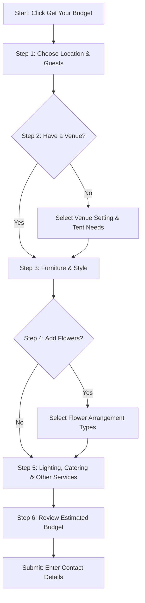
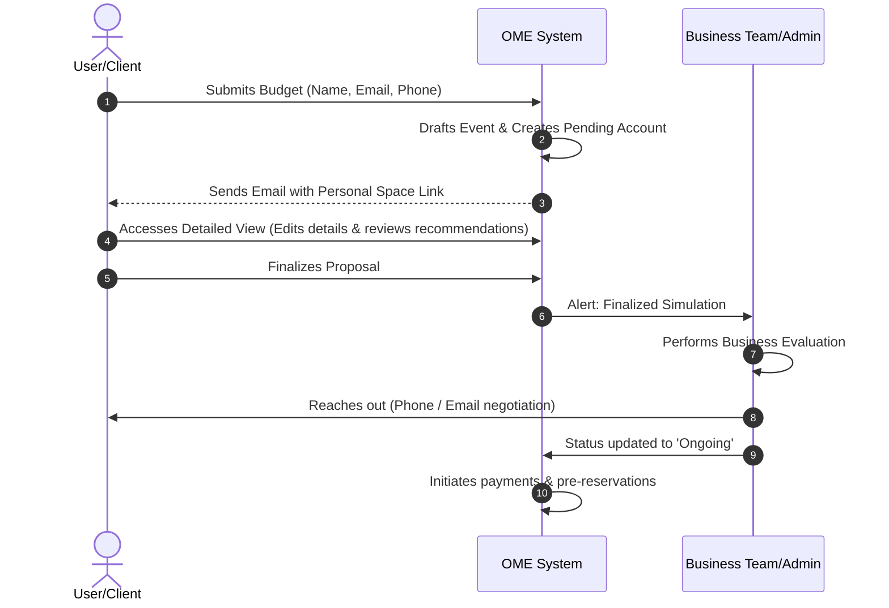

# Application Flow & UX Skeleton

## 1. Page Map & Navigation Paths

Below is the directory map showing how the single-page application resolves URL routes and maps permissions.

```
                  ┌──────────────┐
                  │  Home Page   │
                  │     '/'      │
                  └──────┬───────┘
                         │
         ┌───────────────┼───────────────┐
         ▼               ▼               ▼
 ┌───────────────┐┌───────────────┐┌───────────────┐
 │  Questionnaire││  About Page   ││ Legal Page    │
 │ '/calculator' ││   '/about'    ││ '/disclaimer' │
 └───────┬───────┘└───────────────┘└───────────────┘
                         │
                         ▼
                 ┌───────────────┐ (Auto-Register & Email Link)
                 │Submit Quote   ├────────────────────────┐
                 │(Modal Form)   │                        │
                 └───────────────┘                        ▼
                                                 ┌───────────────┐
                                                 │  Auth Gateway │
                                                 │   '/login'    │
                                                 └───────┬───────┘
                                                         │
                                 ┌───────────────────────┴───────────────────────┐
                                 ▼                                               ▼
                         ┌───────────────┐                               ┌───────────────┐
                         │ Client Space  │                               │  Admin Portal │
                         │ '/dashboard'  │                               │   '/admin'    │
                         │ (Role Client) │                               │ (Role Admin)  │
                         └───────┬───────┘                               └───────────────┘
                                 │
                 ┌───────────────┴───────────────┐
                 ▼                               ▼
         ┌───────────────┐               ┌───────────────┐
         │ Guest Website │               │ Guest Photos  │
         │'/w/[eventId]' │               │'/w/[eventId]/p'│
         └───────────────┘               └───────────────┘
```

---

## 2. User Journey for Creating a Wedding Budget

### 2.1 Overview
*   **User Persona**: Engaged couple or event planner.
*   **Goal**: Create a wedding budget quickly, efficiently, and receive a personalized follow-up proposal.

### 2.2 Phase 1: Budget Calculator Preferences



1.  **Start Budgeting**: User lands on the homepage `/` and clicks on the primary CTA **Get Your Budget** (or **Get Started**) to begin.
2.  **Select Preferences**:
    *   **Choose Location**: North, Center, Lisbon, Alentejo, Algarve.
    *   **Approximate Number of Guests**: Selectable ranges: `50-100`, `100-150`, `150-200`, `200-250`, `250`, `300`, `more than 300`.
    *   **Venue Status Questionnaire**:
        *   *Do you already have a venue?*
            *   **Yes**: Proceed to the next step.
            *   **No**: Select desired wedding setting from options: `Country Place`, `Palace/Castle/Convent`, `Beach`, `City/Urban`, `Garden`, `Mountain/Highland`, `Resort/Hotel`.
            *   *Do you need a tent?*
                *   **Yes**: Select tent type: `Tarki`, `2-sided`, `Indian`, `other`.
                *   **No**: Proceed to the next step.
    *   **Furniture Preferences**:
        *   *Furniture for Cocktail Area?* (Yes / No toggle)
        *   *Furniture for Dining and Party Area?* (Yes / No toggle)
    *   **Flower Selection**:
        *   *Flowers?*
            *   **Yes**: Multi-select checklist specifying flower arrangement types: `Bouquet`, `Boutonnieres`, `Petal Basket`, `Sacrarium Arrangement`, `Altar Arrangement`, `Exterior Church Arrangement`, `Cocktail Area`, `Round Table Centerpieces`, `Rectangular Table Centerpieces`, `Buffets`.
            *   **No**: Proceed to the next step.
    *   **Lighting**: *Do you need lighting?* (Yes / No toggle)
    *   **Catering**: *Do you need catering?* (Yes / No toggle)
    *   **Other Services**:
        *   *Other services?*
            *   **Yes**: Multi-select checklist for professional vendors: `Photographer`, `Videographer`, `DJ`, `Entertainment Service`, `Band`, `Designer/Graphic`.
            *   **No**: Proceed directly to confirmation.

3.  **Review & Submit**:
    *   The application presents a detailed estimated cost breakdown based on the chosen inputs.
    *   Clicking **Submit Quote** opens a slide-over/modal input form.
    *   **Enter Details**: User enters name, email (required), optional phone number, and preferred contact method (Email, Phone, WhatsApp).

---

## 3. Post-Submission Process

Once the user submits their budget, the lifecycle transitions through the following milestones:



1.  **Email Link**: The system sends an email to the user containing a secure tokenized link to access their personal space.
2.  **Personal Space Creation**: A personal space is established. If the user is a returning client, the new event is added as a "Pending" event alongside existing draft entries.
3.  **Event Draft**: The event is automatically drafted and stored in Firestore based on the selections made during the questionnaire.
4.  **Detailed View**: The user accesses their personal dashboard where they can review individual line items, toggle items on/off, change options, and view system-generated recommendations for cost optimizations.
5.  **Finalize Proposal**: Once the user is satisfied with the choices and estimates, they click **Finalize Proposal** within their dashboard.
6.  **Business Evaluation**: The event planning team is alerted. The admin evaluates the client's simulation, matches options with real availability, and reaches out to the client.
7.  **Agreement & Status Update**: When an agreement is reached, the admin changes the event status from `Pending` to `Ongoing`. Initial deposits/payments are processed, and pre-reservations are secured with vendors.

---

## 4. Flow Diagrams & Interaction States

### 4.1 Navigation Paths & Connection Map
```
[Homepage]
   │
   ▼ (Click "Get Your Budget")
[Budget Calculator] (Interactive inputs: Location, Guests, Venue, Tents, Flowers, Toggles)
   │
   ▼ (Dynamic calculation triggers)
[Review Budget] (Detailed cost display + interactive sliders)
   │
   ▼ (Click "Submit Quote")
[Submission Form] (Contact details: Name, Email, Phone, Preferred Contact Method)
   │
   ▼ (Click "Submit")
[Confirmation Page] (Awaiting Team contact + Email dispatched link)
```

### 4.2 State Transitions

```
┌───────────────┐     Generate Budget      ┌──────────────────┐
│ Initial State ├─────────────────────────>│ Budget Generated │
└───────────────┘                          └────────┬─────────┘
                                                    │
                                                    │ Click Submit
                                                    ▼
┌──────────────────────┐    Confirm Contact ┌──────────────────┐
│ Confirmation Received│<───────────────────┤Submission Pending│
└──────────────────────┘                    └──────────────────┘
```

*   **State 1: Initial State**: User has not started or is mid-progress through selections.
*   **State 2: Budget Generated**: Values calculations resolve based on formulas and inputs. Display is updated dynamically.
*   **State 3: Submission Pending**: Form is active in modal overlay, disabling background controls.
*   **State 4: Confirmation Received**: Form submission completes, token is generated in database, email notification is queued, and the dashboard redirect CTA appears.

### 4.3 Interactive Elements Matrix

| Screen | Element | Type | Action & Outcome |
| :--- | :--- | :--- | :--- |
| **Homepage** | "Get Your Budget" | Button | Navigates to `/calculator` step 1. |
| **Calculator** | Guest Count | Range Slider | Updates global guest number, updating dynamic calculation. |
| **Calculator** | Yes/No Toggles | Switch / Cards | Conditionally displays sub-questions (e.g. tent types, flower types). |
| **Review Page** | "Submit" | Button | Opens Submission modal overlay. |
| **Submission** | Personal Form | Text Inputs | Validate fields; click submit triggers Firebase Auth & Firestore write. |
| **Dashboard** | "Add Guest" | Button | Opens slide-out to enter guest name, group, and preferences. |
| **Dashboard** | "Seating Workspace" | Canvas | Allows adding tables, dragging guests from list onto table seats. |
| **Dashboard** | "Timeline Reorder" | Drag Handle | Reorders day-of wedding events chronologically in database. |
| **Guest Portal**| "RSVP Submission" | Form | Writes attendance status, food preferences, and song requests. |
| **Photo Upload**| "Upload Photos" | File Selector | Uploads photos to storage, displaying them instantly in Event Gallery. |
| **Collaborator**| "Invite Partner" | Button/Input | Generates share token email/link giving write access to dashboard. |

---

## 5. Recommended UX Mapping Tools

For designers and engineering handoffs, we recommend maintaining visual maps using:
*   **Figma**: For building interactive high-fidelity prototypes and UI screen design.
*   **Lucidchart**: For complex conditional process flows, database mapping, and logical state engines.
*   **Miro**: For initial user story mapping, team brain-storming, and service blueprinting.

---

## 6. Planning Tools User Flows & Journeys

### 6.1 Guest List & Public RSVP Lifecycle
1. **Importing Contacts**: The couple accesses `/dashboard/guests` and imports contacts via a CSV template or adds them manually.
2. **Wedding Website Design**: The couple toggles sections (e.g., *Registry*, *Our Story*) and copies their public link `/w/[eventId]`.
3. **Guest Interaction**: A guest visits `/w/[eventId]`, clicks **RSVP**, and enters their name to retrieve their invitation. They mark attendance (*Attending* / *Declined*), specify their meal choice, list food allergies, and input a dancefloor song request.
4. **Instant Update**: Submitting the RSVP updates the couple's dashboard statistics in real-time (total attending, dietary restrictions list).

### 6.2 Interactive Seating Chart Canvas
1. **Table Configuration**: The couple navigates to `/dashboard/seating`. They select a table shape (e.g., *Round Table*) and set seating capacity (e.g., *8 seats*). A table node is created on the canvas.
2. **Seating Arrangement**:
   *   An "Unassigned Guests" list displays in the left sidebar.
   *   The user drags a guest name card and drops it onto a specific seat node of a table.
   *   The system saves the `tableId` and `seatNo` in the guest's Firestore document.
   *   The guest's status in the sidebar changes to "Assigned".
3. **Layout Export**: The user clicks **Export Seating Chart**, rendering the canvas to a high-resolution PNG or printable PDF table chart.

### 6.3 Wedding Day Timeline Chronology
1. **Schedule Builder**: The couple navigates to `/dashboard/timeline`. A default chronology is populated (e.g., *Ceremony*, *Reception Cocktail*, *Grand Entrance*, *Dinner*, *First Dance*).
2. **Reordering**: The couple adjusts event start times or drags timeline segments vertically to reorder them.
3. **Vendor Assignment**: Specific vendors (e.g., photographer, band) are linked to timeline blocks, enabling targeted export packages for each vendor.

### 6.4 QR Code Guest Gallery
1. **QR Generation**: In `/dashboard/photos`, a unique QR code is generated. The couple downloads and prints this QR code on physical tabletop cards at the reception.
2. **Guest Uploading**: Guests scan the QR code at the event, redirecting them to `/w/[eventId]/photos`. Without needing an account, they select up to 10 photos at a time from their phone gallery and upload them.
3. **Event Gallery Feed**: Photos sync immediately, displaying in a curated dashboard gallery where the couple can download them in bulk.
