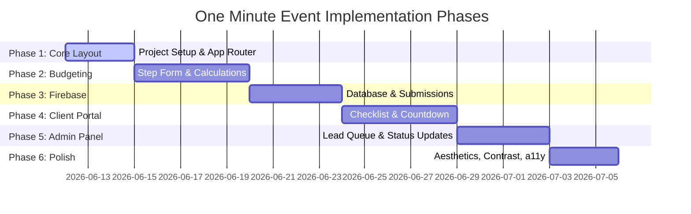

# Implementation Plan — Technical & Build Guide

## 1. Technical Architecture

One Minute Event is built using **Next.js** with the **React App Router** and **TypeScript** for robust typing. Styling is achieved using **Vanilla CSS** (leveraging CSS Modules for component-scoped scoping and global stylesheets for utility styles).

```
┌────────────────────────────────────────────────────────────────────────┐
│                   Frontend: Next.js + React (TypeScript)               │
├─────────────────────┬──────────────────────────┬───────────────────────┤
│    Routing:         │     State Management:    │    Styles:            │
│    App Router       │     React Context / Hooks│    Vanilla CSS Modules│
└──────────┬──────────┴─────────────┬────────────┴───────────┬───────────┘
           │                        │                        │
           ▼                        ▼                        ▼
┌────────────────────────────────────────────────────────────────────────┐
│                         Backend Services: Firebase                     │
├─────────────────────┬──────────────────────────┬───────────────────────┤
│    Authentication:  │     Database:            │    Hosting:           │
│    Firebase Auth    │     Cloud Firestore      │    Firebase AppHost   │
└─────────────────────┴──────────────────────────┴───────────────────────┘
```

### Component Stack & Server/Client Components Architecture:
*   **Framework**: Next.js App Router.
*   **Rendering Strategy**: 
    *   *Static/Server Components (RSC)*: Core layouts, public static pages (`/about`, `/disclaimer`), and the landing page (`/`). Public guest wedding sites (`/w/[eventId]`) are Server-Side Rendered (SSR) for fast LCP, dynamic content fetching, and search engine optimizations.
    *   *Client Components (`'use client'`)*: Used for interactive components containing state transitions, keyboard focus cycles, canvas interactions, or form validation, such as the multi-step calculator, the interactive seating drag-and-drop workspace, checklist toggles, and photo upload interfaces.
*   **Build Tool**: Next.js Compiler (SWC).
*   **Language**: TypeScript (Strict mode enabled for type safety).
*   **State Management**: React Context API for client-side session states; React hooks (`useState`, `useReducer`) for localized component state.
*   **Database**: Cloud Firestore for synchronized real-time collaboration.

---

## 2. Database Schema (Cloud Firestore)

Firestore holds five core collections. Below are the structure requirements and TypeScript interfaces.

### 2.1 `users` (Collection)
```typescript
interface UserProfile {
  uid: string;            // Matches Firebase Auth UID
  email: string;
  displayName: string;
  phoneNumber?: string;
  role: 'client' | 'admin';
  createdAt: string;      // ISO Timestamp
}
```

### 2.2 `suppliers` (Collection)
```typescript
interface Supplier {
  id: string;
  name: string;
  category: 'venue' | 'catering' | 'decor' | 'photography' | 'music' | 'florist';
  tier: 'standard' | 'premium' | 'luxury';
  basePrice: number;       // Flat cost (e.g., venue rental, photography package)
  pricePerGuest: number;   // Cost that scales with wedding size (e.g., catering, welcome drinks)
  description: string;
  location: string;
  imageUrl?: string;
}
```

### 2.3 `budgets` (Collection)
```typescript
interface BudgetSelection {
  id: string;
  userId?: string;                   // Linked if authenticated/registered
  location: 'North' | 'Center' | 'Lisbon' | 'Alentejo' | 'Algarve';
  guestCountRange: '50-100' | '100-150' | '150-200' | '200-250' | '250' | '300' | 'more than 300';
  hasVenue: boolean;
  venueSetting?: 'Country Place' | 'Palace/Castle/Convent' | 'Beach' | 'City/Urban' | 'Garden' | 'Mountain/Highland' | 'Resort/Hotel';
  needsTent: boolean;
  tentType?: 'Tarki' | '2-sided' | 'Indian' | 'other';
  cocktailFurniture: boolean;
  diningPartyFurniture: boolean;
  needsFlowers: boolean;
  flowerTypes?: ('Bouquet' | 'Boutonnieres' | 'Petal Basket' | 'Sacrarium Arrangement' | 'Altar Arrangement' | 'Exterior Church Arrangement' | 'Cocktail Area' | 'Round Table Centerpieces' | 'Rectangular Table Centerpieces' | 'Buffets')[];
  needsLighting: boolean;
  needsCatering: boolean;
  otherServices: ('Photographer' | 'Videographer' | 'DJ' | 'Entertainment Service' | 'Band' | 'Designer/Graphic')[];
  totalEstimatedCost: number;
  status: 'draft' | 'submitted' | 'ongoing' | 'archived';
  createdAt: string;
}
```

### 2.4 `submissions` (Collection)
```typescript
interface LeadSubmission {
  id: string;
  budgetId: string;
  clientInfo: {
    name: string;
    email: string;
    phone?: string;
    preferredContactMethod: 'Email' | 'Phone' | 'WhatsApp';
    additionalNotes?: string;
  };
  assignedAdminId?: string;
  status: 'pending' | 'reviewing' | 'contacted' | 'ongoing' | 'cancelled';
  createdAt: string;
  updatedAt: string;
}
```

### 2.5 `milestones` (Collection)
```typescript
interface Milestone {
  id: string;
  userId: string;
  budgetId: string;
  title: string;
  description: string;
  dueDate: string;
  status: 'pending' | 'completed';
  category: 'payment' | 'booking' | 'preparation';
  order: number;
}

### 2.6 `guests` (Collection)
```typescript
interface Guest {
  id: string;
  eventId: string;
  name: string;
  group: 'family' | 'friends' | 'vip' | 'other';
  rsvpStatus: 'attending' | 'declined' | 'pending';
  foodPreference?: string;
  tableId?: string;       // Linked to tables collection
  seatNo?: number;
  phone?: string;
  email?: string;
  songRequest?: string;
  createdAt: string;
}
```

### 2.7 `tables` (Collection)
```typescript
interface Table {
  id: string;
  eventId: string;
  name: string;          // e.g., "Table 1" or "Sweetheart Table"
  type: 'round' | 'rectangular' | 'banquet';
  capacity: number;
  xPosition: number;      // Canvas coordinates for drag-and-drop
  yPosition: number;
}
```

### 2.8 `timeline_events` (Collection)
```typescript
interface TimelineEvent {
  id: string;
  eventId: string;
  time: string;           // HH:MM
  durationMinutes: number;
  title: string;
  description: string;
  assignedVendorId?: string;
  order: number;
}
```

### 2.9 `photos` (Collection)
```typescript
interface GuestPhoto {
  id: string;
  eventId: string;
  imageUrl: string;
  uploaderName: string;
  createdAt: string;
}
```

### 2.10 `collaborators` (Collection)
```typescript
interface Collaborator {
  id: string;
  eventId: string;
  email: string;
  role: 'owner' | 'editor';
  status: 'pending' | 'accepted';
  inviteToken?: string;
}
```
```

---

## 3. Core Features & Requirements

### 3.1 Interactive Budget Calculator (Questionnaire)
*   **Step 1: Location & Guests**: Choose location (North, Center, Lisbon, Alentejo, Algarve) and approximate guest count (50-100, 100-150, 150-200, 200-250, 250, 300, more than 300).
*   **Step 2: Venue & Tent**: Specify venue ownership status (Yes/No). If No, select setting style (Country Place, Palace, Beach, etc.). Choose tent requirement (Yes/No) and tent style (Tarki, 2-sided, Indian, other).
*   **Step 3: Furniture & Styling**: Select Cocktail Area furniture needs (Yes/No) and Dining/Party Area furniture needs (Yes/No).
*   **Step 4: Flower Details**: Indicate flower needs (Yes/No) and select specific arrangement types (Bouquet, Boutonnieres, Altar, Table Centerpieces, etc.).
*   **Step 5: Catering, Lighting & Services**: Toggles for Catering (Yes/No) and Lighting (Yes/No). Select checkbox options for other vendors (Photographer, Videographer, DJ, Entertainment Service, Band, Designer/Graphic).
*   **Step 6: Review & Cost Breakdown**:
    *   Dynamic SVG Donut Chart showing category cost shares.
    *   Interactive sliders adjusting counts to see instant budget shifts.
    *   Pricing formula:
        $$\text{Total Cost} = \sum (\text{Base Price}) + (\text{Guest Count} \times \sum \text{Price Per Guest})$$

### 3.2 Lead & Quote Submission
*   **Action**: Clicking "Submit Quote" opens a slide-over/modal form.
*   **Data Fields**: Name, Email, Phone, and Custom Message.
*   **Auth Side-Effect**: If the user doesn't have an account, the frontend registers a placeholder account using their email and generates a random password. It sends a sign-up link or redirects them to set a custom password, making entry frictionless.
*   **SLA Trigger**: The system logs the submission timestamp and sets a `status` of `pending`.

### 3.3 Personalized Client Space (Dashboard) & Planning Tools
*   **Accessibility**: Protected client routes (`/dashboard`).
*   **Countdown Widget**: Target wedding date countdown (Days / Hours / Minutes).
*   **Checklist Tracker**: Milestones loaded from the `milestones` database. Clients can check items off, triggering smooth checkbox animations.
*   **Vendor Summary**: List of selected suppliers with description, contact, and confirmation status.
*   **Guest List & RSVP Manager**: Interface to add/edit/delete guest contacts, import/export CSV files, and filter by attendance.
*   **Public Guest RSVP Portal**: A customizable landing page (`/w/:eventId`) containing event details, countdown, and an interactive RSVP form that feeds directly back into the guest list database.
*   **Interactive Seating Workspace**: Canvas element where users add round/rectangular tables and drag-and-drop guests onto specific seats.
*   **Timeline Builder**: Chronological list of events for the wedding day with drag-and-drop reordering.
*   **Shared Album & Guest Upload**: QR-code triggered route (`/w/:eventId/photos`) where guests upload photos from their mobile devices directly into the couple's cloud-hosted gallery.

### 3.4 Admin Control Panel
*   **Route**: `/admin` (guarded by user role validation in Firestore rules).
*   **Submissions Grid**: Columns for date, client name, email, status (with color badges), and action items.
*   **Response Interface**: Inline text area to compose custom packages, modify estimated line items, and mark submission as `contacted`.

---

## 4. Phased Implementation Roadmap



### Phase 1: Environment & Setup
1. Initialize Next.js + TS workspace with App Router.
2. Setup CSS custom properties system in `app/globals.css` (tokens for sizing, fonts, colors, shadow, grid).
3. Establish dynamic and static folder layouts (`/`, `/about`, `/disclaimer`, `/dashboard`, `/admin`, `/w/[eventId]`, `/w/[eventId]/photos`).

### Phase 2: Budget Step Form & Calculator
1. Build the multi-step questionnaire component.
2. Implement local state management to store selections.
3. Write the pricing engine utilizing static mock vendor data.
4. Build the summary breakdown UI (interactive slider + SVG breakdown chart).

### Phase 3: Firebase Configuration & Submissions
1. Connect project to Firebase console.
2. Implement Email/Password authentication.
3. Add submission database write operations.
4. Establish Firestore security rules targeting collection authorization (e.g. users write only their own records, admins read all).

### Phase 4: Client Dashboard & Integrated Planning Tools
1. Design `/dashboard` layout structure and sidebar navigation panel.
2. Build Countdown and Milestone checklist subcomponents with complete animations.
3. Create trigger to pre-populate default milestones (e.g., "Sign contract", "First deposit") upon lead submission.
4. Implement Guest List Manager and public-facing RSVP Portal `/w/:eventId` with Firestore sync.
5. Create Seating Chart Canvas allowing round/rectangular table creation and drag-and-drop seating logic.
6. Build interactive Day-of Itinerary Timeline editor with drag-and-drop reordering.
7. Implement guest photo upload interface `/w/:eventId/photos` with QR code generation.
8. Establish collaborator invite token creation and database permission checking.

### Phase 5: Admin Workstation
1. Build admin table displaying all submissions.
2. Construct review detail sidebar allowing admins to edit line items, update state, and input response logs.

### Phase 6: Visual Excellence & A11y
1. Layer premium styles: Glassmorphism shadows, backdrop-filters, custom micro-animations (buttons scaling on press, checkmark draws).
2. Audit color contrasts and add full keyboard tab-indices for accessibility.
