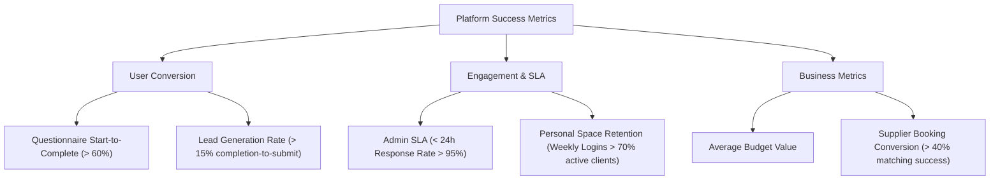

# Master Plan — One Minute Event

## 1. Vision & Core Purpose

Wedding planning has historically been a fragmented, stressful, and time-consuming process. The typical couple spends months researching vendors, comparing opaque pricing structures, and managing complex spreadsheets. 

**One Minute Event** is a groundbreaking web application designed to revolutionize the wedding planning industry. By combining automated budgeting tools with a personalized client space and expert backend coordination, the platform reduces the time spent on planning from months to minutes.

Our core purpose is to transform wedding planning from a source of anxiety into an enjoyable, transparent, and highly efficient journey.

---

## 2. Target Users & Needs

We address two primary user segments: **Couples (Clients)** who plan their wedding, and the **One Minute Event Team (Admins)** who coordinate with suppliers and manage client bookings.

### User Persona Matrix

| Persona | Key Needs | Pain Points | Platform Solutions |
| :--- | :--- | :--- | :--- |
| **The Busy Professional** | Speed, convenience, and direct execution. | No time to contact 50+ vendors or manage endless emails. | A guided 5-step questionnaire generating an instant budget with one-click submission. |
| **The Budget-Conscious Couple** | Cost transparency, alternatives, and visual budget breakdowns. | Hidden fees, opaque pricing, and unexpected vendor markups. | Real-time budget breakdown by category (catering, venue, decor) showing cost options. |
| **The Unique/Cultural Couple** | Customization, theme flexibility, and specific vendor types. | Inflexible package deals that don't fit specific cultural or personal requirements. | Dynamic preference selection (e.g., specific menus, styles, decor) mapped to matching suppliers. |
| **The OME Event Planner (Admin)** | Standardized submissions, easy vendor matching, rapid communications. | Unstructured client emails, manual quote calculations, and tracking delays. | A centralized Admin Dashboard displaying structured client submissions and vendor matching tools. |

---

## 3. Primary Value Proposition

> [!TIP]
> **"Plan Your Dream Wedding in Minutes, Not Months."**

One Minute Event delivers value through three core pillars:

1. **Instant Cost Transparency**: Users receive an immediate, detailed budget estimate after selecting their wedding size, date, style, and vendor preferences—no waiting, no phone calls.
2. **Frictionless Engagement**: Submitting a budget requires minimal information (Name, Email, Phone), which instantly generates a draft booking and kicks off a 24-hour expert response SLA.
3. **A Unified Workspace**: Once committed, the client gains access to their **Personal Space**—a central hub containing their wedding countdown, custom checklist, payment scheduler, and booked vendor details.

---

## 4. Success Metrics & Goals

To evaluate the success of the platform, we track key performance indicators (KPIs) across three areas:

### Key Metrics Table

| Metric | Target | Measurement Method |
| :--- | :--- | :--- |
| **Questionnaire Completion Rate** | $\ge 60\%$ | Funnel tracking on step transitions. |
| **Lead Submission Rate** | $\ge 15\%$ | Submissions divided by completed budgets. |
| **Response SLA** | $\ge 95\%$ under 24 hours | Time difference between submission and admin response in Firestore. |
| **Personal Space Engagement** | $\ge 3$ visits per week | Session tracking for authenticated dashboard users. |
| **Customer Satisfaction (CSAT)** | $\ge 4.8 / 5.0$ | Post-event and post-booking client surveys. |
